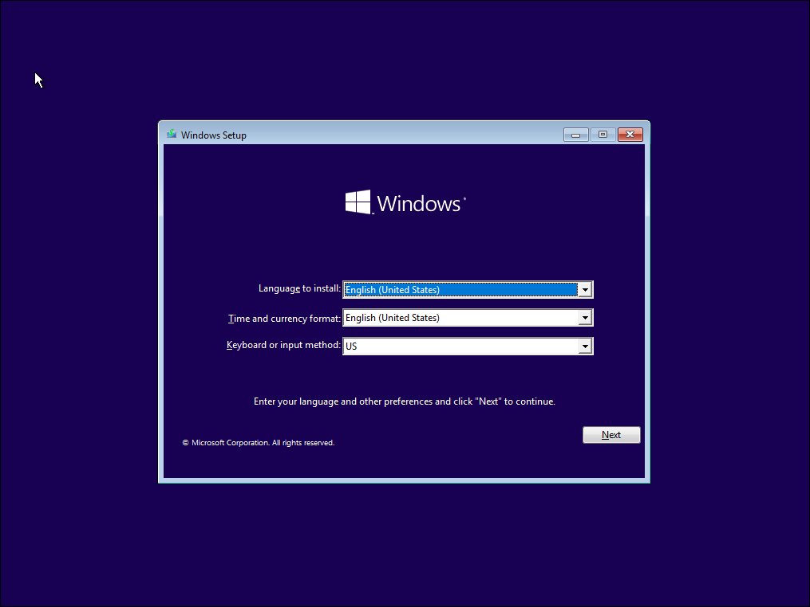
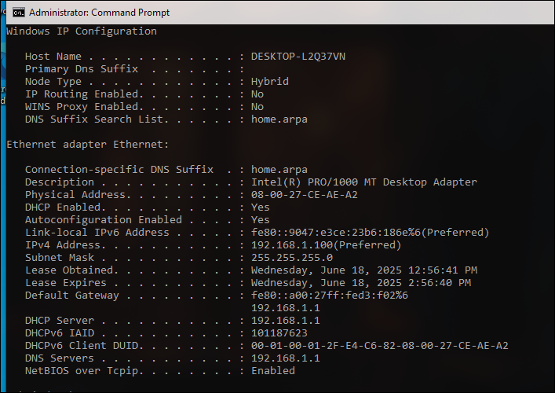

# Windows Client VM Setup: Establishing the First Lab Workstation

> This project focused on the successful deployment and network integration of a Windows client virtual machine. It will be my foundational client in the isolated `LabNet`.

---

## 🚀 Overview

This lab project's primary objective was to deploy and configure a functional Windows 10 client VM and  integrate it into the `LabNet` managed by pfSense. Through this exercise, I aimed to develop and showcase proficiency in:
* Virtual Machine provisioning and operating system installation for client endpoints.
* Precise configuration of virtual network adapters for an internal, isolated network segment.
* Verification of DHCP service functionality and internet connectivity routing through a firewall.
* Initial client OS setup and configuration for a lab environment.

### Goals & Objectives

* [x] **Primary Goal:** Successfully create and connect the Windows client VM to the `LabNet`.
* [x] **Secondary Goal:** Verify that the Windows client VM automatically receives an IP address from pfSense's DHCP server.
* [x] **Stretch Goal:** Verify that the Windows client VM can access the internet through the pfSense firewall.

---

## 🏛️ Lab Architecture & Design

This section details the virtual environment setup for this specific project, highlighting its integration with the existing `pfSense-Firewall` component.

### Virtual Machine Specifications

| VM Name            | Operating System      | RAM  | vCPUs | Disk Size | IP Address (Static/DHCP) | Purpose                               |
| :----------------- | :-------------------- | :--- | :---- | :-------- | :----------------------- | :------------------------------------ |
| `pfSense-Firewall` | pfSense               | 1GB  | 1     | 16GB      | WAN: DHCP, LAN: 192.168.1.1/24 | Lab Gateway, DHCP, DNS, Firewall      |
| `Win10-Client-01`  | Windows 10 Pro (64-bit)| 2GB  | 1     | 40GB      | DHCP                     | First Lab Workstation / Client Test VM |

---

## 🛠️ The Journey: Step-by-Step Implementation

This section includes the practical steps taken, focusing on technical configuration and decisions made during the client VM setup. 

### 1. Windows ISO Acquisition
* **Task:** Obtained the necessary Windows 10 installation media.
* **Details:** Downloaded the official Windows 10 (64-bit) ISO image from Microsoft's software download center.
* **Justification:** A valid and current Windows ISO is required for the operating system installation within the virtual machine.

### 2. VirtualBox VM Creation for Windows Client
* **Task:** Created the base virtual machine for the Windows client.
* **Details:**
    * In VirtualBox Manager, utilized "Expert Mode" for more configuration options.
    * Named the VM `Win10-Client-01`.
    * Specified OS Type: `Microsoft Windows`, Version: `Windows 10 (64-bit)`.
    * Attached the downloaded Windows 10 ISO image as virtual optical media.
    * Allocated **2048 MB (2 GB)** of Base Memory (RAM) and **1 Processor**.
    * Provisioned a new virtual hard disk of **40 GB**, configured as a `Dynamically allocated` VDI.
* **Justification:** The resource allocation (2GB RAM) was a deliberate choice to balance guest OS usability with the host machine's 16GB RAM constraint. Dynamic allocation conserves host storage until needed.

### 3. Network Adapter Configuration for `LabNet`
* **Task:** Configured the network adapter to integrate the Windows client VM into the isolated lab network.
* **Details:**
    * Accessed the VM's `Network` settings (Adapter 1).
    * Enabled the network adapter.
    * Set "Attached to:" as **`Internal Network`**, and named it **`LabNet`**.
    * Set "Promiscuous Mode" to **`Deny`**.
    * Ensured Adapter 2, 3, and 4 were disabled.
* **Justification:** Connecting to `Internal Network` named `LabNet` ensures strict isolation, forcing all client network traffic through the `pfSense-Firewall` VM's LAN interface. Setting Promiscuous Mode to `Deny` is appropriate for a client, as it eliminates unnecessary packet exposure and enhances security.

### 4. Windows 10 OS Installation Execution
* **Task:** Performed the full installation of Windows 10 within the `Win10-Client-01` VM.
* **Details:**
    * Started the VM, proceeding through the Windows installer prompts.
    * Selected language, time, and keyboard layout.
    * Chose "Custom: Install Windows only (advanced)" for installation type.
    * Selected the 40GB unallocated virtual disk, created partitions, and proceeded.
    * Allowed the installation to complete through multiple reboots.
    * During the Out-Of-Box Experience (OOBE), navigated through region/keyboard settings. I bypassed Microsoft account login by selecting "I don't have internet" to create a local user profile.
    * Completed final privacy settings and reached the Windows desktop.
* **Justification:** A clean custom installation ensures no conflicts. Bypassing online account setup is standard for isolated lab VMs to simplify management and avoid external dependencies.
* **Screenshot:** 

---

## ✅ Verification & Evidence of Understanding

This section details the methods and outcomes used to confirm the Windows client VM's successful installation and its functional integration into the `LabNet`, providing empirical proof of its operational status.

* **Test 1: Windows OS Installation Completion**
    * **Method:** Successfully completed the Windows 10 operating system installation within the VirtualBox VM, navigating all setup prompts (language, region, keyboard, account creation).
    * **Expected Result:** The Windows desktop environment should load, indicating a complete and functional OS installation.
    * **Actual Result:** The Windows 10 desktop loaded successfully.
    * **Significance:** Confirms the client operating system is fully installed and ready for network integration and further configuration.

* **Test 2: DHCP Lease Acquisition from pfSense**
    * **Method:** Ensured `pfSense-Firewall` VM was running. Opened Command Prompt (`cmd.exe`) within the Windows client VM and executed `ipconfig /release` followed by `ipconfig /renew` to force a new DHCP request. Subsequently, `ipconfig /all` was executed to inspect network adapter details.
    * **Expected Result:** The Ethernet adapter should display an IPv4 Address within the `192.168.1.0/24` subnet, with the Default Gateway and DHCP Server both pointing to `192.168.1.1` (pfSense's LAN IP).
    * **Actual Result:**
        * IPv4 Address: `192.168.1.100`
        * Subnet Mask: `255.255.255.0`
        * Default Gateway: `192.168.1.1`
        * DHCP Server: `192.168.1.1`
        * DNS Servers: `192.168.1.1`

    * **Significance:** This conclusively validates that the Windows client VM is correctly connected to the `LabNet` and successfully obtained its network configuration from the pfSense firewall's DHCP server, unequivocally confirming pfSense's role as the network's central service provider.
    * **Screenshot:**
    * 
      
* **Test 3: Internet Connectivity Through pfSense**
    * **Method:** From the same Command Prompt, executed `ping google.com` to verify external network reachability.
    * **Expected Result:** Successful ICMP echo replies from `google.com`.
    * **Actual Result:** Pings to `google.com` were successful.
    * **Significance:** Confirms that the Windows client VM's traffic is correctly routed through the pfSense firewall to the internet, demonstrating end-to-end network functionality within the lab environment.

---

## 💡 The Experience: Lessons & Reflections

### What Went Well

* **Success 1:** The process of creating the Windows client VM and configuring its network adapter proved straightforward and efficient.
    * **Reason:** Prior experience gained from troubleshooting and setting up the `pfSense-Firewall` VM significantly streamlined the configuration workflow for the client VM.

### Challenges & How I Overcame Them

* **Challenge 1:** Initial failure of the Windows client VM to obtain an IP address and reach the internet.
    * **Diagnosis:** Identified that the `pfSense-Firewall` VM, acting as the `LabNet`'s DHCP server and gateway, was not running.
    * **Solution:** Powered on the `pfSense-Firewall` VM, allowed it to fully boot, then used `ipconfig /release` and `ipconfig /renew` within the Windows client VM to force a new DHCP request.
    * **Lesson Learned:** Reinforced the fundamental understanding of network dependencies within a virtualized environment; a central service provider (like a firewall/DHCP server) must be operational for dependent clients to function correctly.

* **Challenge 2:** Bypassing forced Microsoft account login during Windows 10/11 OOBE.
    * **Diagnosis:** Windows 10/11 increasingly pushes online account creation, which is unnecessary and undesirable for isolated lab VMs.
    * **Solution:** Utilized the "I don't have internet" or "Offline account" options, or the `oobe\bypassnro` command prompt trick if necessary (though not explicitly needed for this instance).
    * **Lesson Learned:** Practical knowledge of bypassing default online behaviors is crucial for efficient and isolated lab environment setup, preventing unwanted external connectivity or telemetry.

### Key Takeaways

* **Technical Skill Enhancement:** Acquired hands-on experience in the end-to-end deployment of a client operating system within a custom virtual network. Solidified skills in VirtualBox VM provisioning and precise network adapter configuration for client roles.
* **Cybersecurity Conceptual Reinforcement:** Deepened understanding of isolated `Internal Networks` as a key segmentation strategy. Reinforced the critical role of a central network appliance (pfSense) in delivering essential network services (DHCP, DNS, routing) to internal clients.
* **Analytical Insight ("Aha!" Moment):** A clear realization of the client-server relationship in a virtual network context, where client VMs are entirely dependent on the operational status of services provided by the virtual firewall/router.

---

## 🏆 Final Outcome & Future Scope

### Project Summary

This project successfully established a functional Windows client virtual machine, `Win10-Client-01`, and seamlessly integrated it into the isolated `LabNet`. The VM successfully acquired an IP address from the `pfSense-Firewall`'s DHCP server and demonstrated robust internet connectivity routed through pfSense. This client VM now serves as a verified endpoint within the lab's secure infrastructure.

### Future Improvements

* [ ] **Objective 1:** Install VirtualBox Guest Additions to enhance usability (e.g., seamless mouse integration, shared clipboard, better display resolution).
* [ ] **Objective 2:** Prepare this Windows client VM to join the Active Directory domain (to be established in the next project).
* [ ] **Objective 3:** Implement initial hardening measures on the Windows client VM (e.g., Windows Firewall configuration, disabling unnecessary services).

### Related Notes

* [[pfSense Firewall VM Setup]] (The foundational network component.)
* [[Active Directory Lab Setup]] (The immediate subsequent project.)
---
